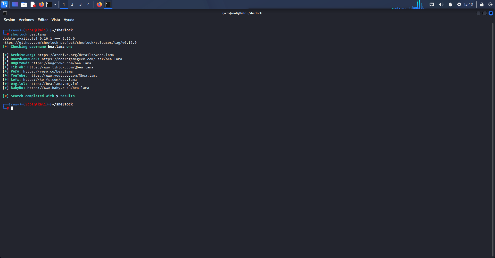

# Sistema Inteligente de Auditoría OSINT: Sherlock & Intelligence X

Este repositorio contiene un prototipo funcional para automatizar la recolección de huella digital y el análisis de riesgos utilizando herramientas OSINT combinadas con Modelos de Lenguaje Avanzados (LLMs) como ChatGPT y Claude.

El sistema resuelve el problema del "OSINT Disperso" y la "Toma de Decisiones" manual, unificando las fuentes de información en un único reporte de inteligencia generado por IA.

---

## Flujo de Trabajo del Sistema

El script realiza la recolección de datos en bruto de manera automatizada y utiliza la API de IA para generar el diagnóstico:

* **Fase de Rastreo:** Búsqueda automatizada de alias en redes sociales con Sherlock.
* **Fase de Filtraciones:** Consulta de brechas de datos de correos o dominios en IntelX.
* **Fase de Análisis:** Procesamiento de datos mediante IA para correlacionar perfiles, clasificar el nivel de riesgo y redactar un informe de mitigación.

---

## Capturas de Pantalla y Pruebas de Uso

### Ejecución del Escáner Sherlock
Muestra del rastreo de nombres de usuario en tiempo real:

### Extracción de Brechas en Intelligence X
Detección de correos comprometidos en bases de datos filtradas:

### Reporte de Riesgos Generado por la IA
El resultado final maquetado de forma analítica por la Inteligencia Artificial:

---

## Despliegue Rápido

Para ver las instrucciones completas de instalación, configuración del entorno virtual y ejecución de los scripts, consulta el documento de soporte:

👉 **[Ver el Manual de Sherlock](sherlock.md)**

👉 **[Ver el Manual de Intelligence X](intelligence.md)**

👉 **[Ver el Manual Automatización](automatizacion.md)**
